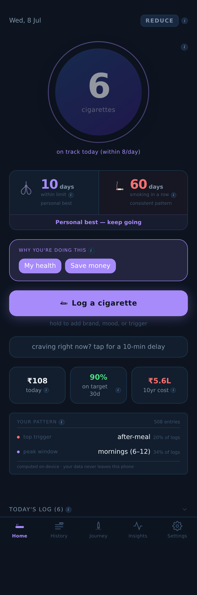
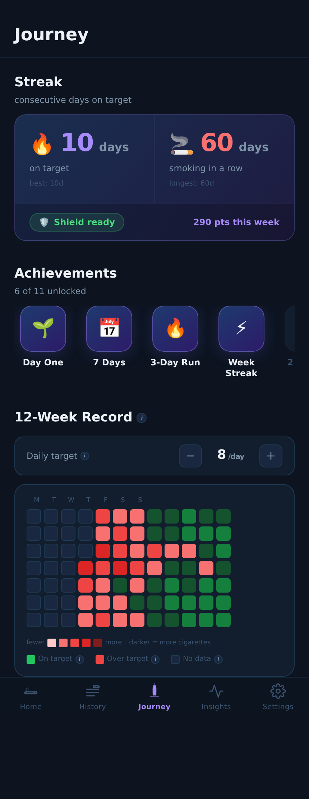
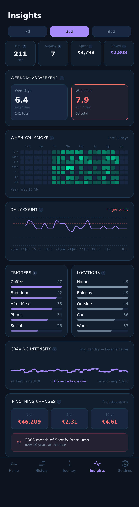
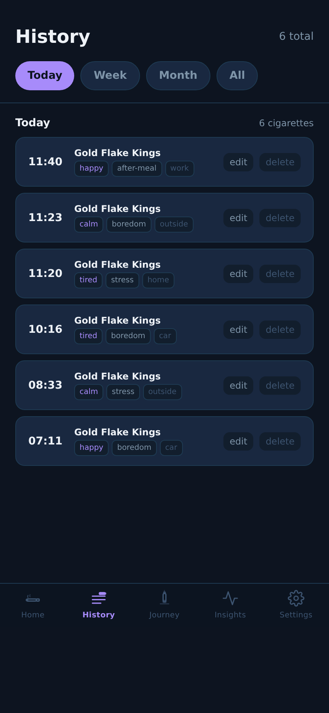
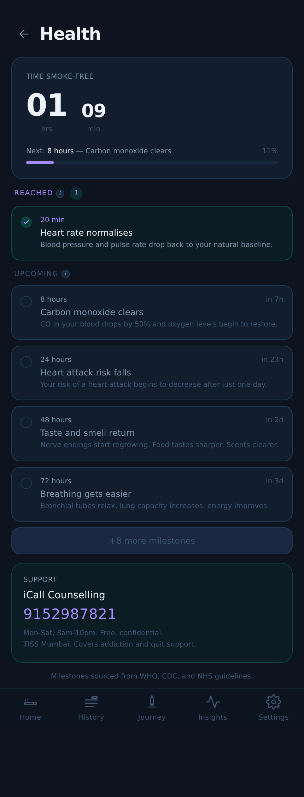

# Smoking Tracker

**Live app →** https://aneeshk-ds.github.io/smoking-tracker/

A private, offline-first PWA for tracking a smoking habit. Local-first — works fully offline with no account. Sign in optionally to back up and sync across devices.

---

## Screenshots

<p align="center">
  
  
  
</p>
<p align="center">
  
  
</p>

*Shown with sample data (Reduce goal, 8/day target).*

---

## What it does

- Log cigarettes with one tap (long-press for details: trigger, location, mood, craving level)
- Honest streaks that never reset to zero on a slip
- Home screen insights: spending, 10-year cost projection, smoke-free rate, pattern card
- Insights tab: heatmap, daily trend, weekday/weekend split, trigger + location breakdown, craving intensity trend, cost projection
- Craving support: 10-minute delay timer + 4-4-4 breathing exercise
- Lapse recovery prompt when goal is exceeded — shows previous run and personal reason
- Health milestones: WHO/CDC recovery timeline with live elapsed timer
- Monthly report (print to PDF)
- Share card (PNG for social)
- JSON/CSV export and import
- PWA — installable on iOS and Android, works fully offline

---

## Stack

| Layer | Library |
|---|---|
| UI | React 18 + Vite 5 |
| Styling | Tailwind CSS v3 (custom CSS variable dark theme) |
| Storage | Dexie.js v3 (IndexedDB — everything stays on device) |
| Charts | Recharts |
| Dates | date-fns |
| Deploy | GitHub Actions → GitHub Pages |

---

## Run locally

```bash
npm install
npm run dev
```

Open `http://localhost:5173`.

---

## Deploy

Push to `main`. The GitHub Actions workflow in `.github/workflows/deploy.yml` builds and deploys automatically:

```
https://<your-username>.github.io/<repo-name>/
```

---

## Add to Home Screen

**iOS (Safari):** Share → Add to Home Screen

**Android (Chrome):** Menu → Add to Home Screen / Install App

---

## Privacy

- Zero data leaves the device
- No analytics, no tracking, no ads
- All entries stored in the browser's IndexedDB
- Settings → Export JSON to back up locally
